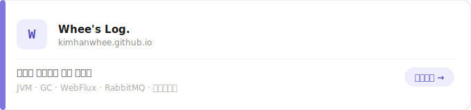

<!--
**KimHanWhee/KimHanWhee** is a ✨ _special_ ✨ repository because its `README.md` (this file) appears on your GitHub profile.

Here are some ideas to get you started:

- 🔭 I’m currently working on ...
- 🌱 I’m currently learning ...
- 👯 I’m looking to collaborate on ...
- 🤔 I’m looking for help with ...
- 💬 Ask me about ...
- 📫 How to reach me: ...
- 😄 Pronouns: ...
- ⚡ Fun fact: ...
-->

## 

---

### 🛠 Tech Stack

---

### 🚧 Currently Working On

**[CHARYEOT. (차렷.)](https://github.com/KimHanWhee/CHARYEOT)**  
게임 패배의 범인 찾기 사이트.

---

### 📎 Links

<a href="https://kimhanwhee.github.io/">
  <picture>
    <source media="(prefers-color-scheme: dark)" srcset="./assets/blog-card-dark.svg">
    
  </picture>
</a>

---

<!--  -->

